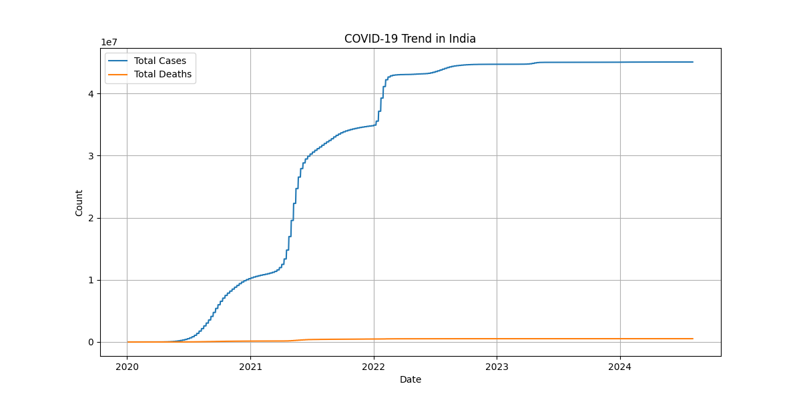

# 📊 COVID-19 Data Analysis (India)

## 📌 Project Overview

This project analyzes real-world COVID-19 data using Python.
The goal is to understand trends in total cases and deaths over time in India.

---

## 🛠️ Technologies Used

* Python
* Pandas
* Matplotlib

---

## 📂 Dataset

* Source: Our World in Data (OWID)
* Contains global COVID-19 statistics including cases, deaths, and dates

---

## 📈 Key Features

* Data cleaning and preprocessing
* Time-series analysis
* Visualization of COVID-19 trends in India

---

## 📊 Output Visualization



---

## ▶️ How to Run

1. Install required libraries:

```
pip install pandas matplotlib
```

2. Run the script:

```
python main.py
```

---

## 💡 Insights

* Rapid increase in cases during 2021 (second wave)
* Death rate trend follows case growth
* Data shows stabilization after peak periods

---

## 🚀 Future Improvements

* Add interactive dashboards (Power BI/Tableau)
* Compare multiple countries
* Add machine learning predictions

---

## 👩‍💻 Author

Tarushi Mahesh

